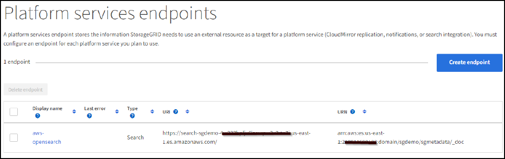
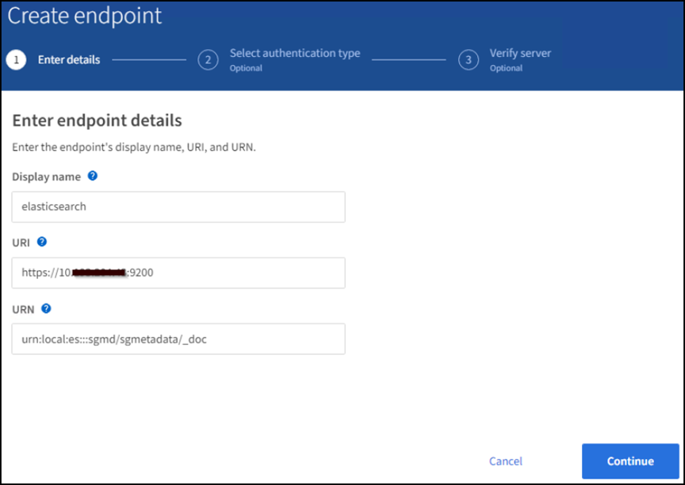

= Configurez le service d'intégration de recherche StorageGRID
:allow-uri-read: 

_Angela Cheng_

[role="lead"]
Ce guide fournit des instructions détaillées sur la configuration du service d'intégration de recherche NetApp StorageGRID 11.6 avec Amazon OpenSearch Service ou avec Elasticsearch sur site.

== Introduction

StorageGRID prend en charge trois types de services de plateforme.

* *Réplication StorageGRID CloudMirror*. Mettre en miroir des objets spécifiques d'un compartiment StorageGRID vers une destination externe spécifiée.
* *Notifications*. Notifications d'événements par compartiment pour envoyer des notifications sur des actions spécifiques réalisées sur des objets vers un Amazon simple notification Service (Amazon SNS) externe spécifié.
* *Service d'intégration de recherche*. Envoyez les métadonnées d'objet S3 (simple Storage Service) à un index Elasticsearch spécifique où vous pouvez rechercher ou analyser les métadonnées à l'aide du service externe.

Les services de plateforme sont configurés par le locataire S3 via l'interface du gestionnaire des locataires. Pour plus d'informations, voir https://docs.netapp.com/us-en/storagegrid-116/tenant/considerations-for-using-platform-services.html["Considérations relatives à l'utilisation des services de plate-forme"^].

Ce document est un supplément au https://docs.netapp.com/us-en/storagegrid-116/tenant/index.html["Guide des locataires StorageGRID 11.6"^] et fournit des instructions détaillées et des exemples de configuration du terminal et des compartiments pour les services d'intégration de la recherche. Les instructions d'installation d'Amazon Web Services (AWS) ou de Elasticsearch sur site indiquées ici sont fournies à des fins de test ou de démonstration uniquement.

Les participants doivent maîtriser Grid Manager et le Gestionnaire de locataires, et avoir accès au navigateur S3 pour effectuer des opérations de chargement (PUT) et de téléchargement (GET) de base pour les tests d'intégration de la recherche StorageGRID.

== Créez des locataires et activez les services de plateforme

. Créez un locataire S3 à l'aide de Grid Manager, entrez un nom d'affichage et sélectionnez le protocole S3.
. Sur la page d'autorisation, sélectionnez l'option Autoriser les services de plate-forme. Vous pouvez également sélectionner d'autres autorisations, si nécessaire.
+
image::../media/storagegrid-search-integration-service/sg-sis-select-permissions.png[Capture d'écran de sélection des autorisations]

. Configurez le mot de passe initial de l'utilisateur root du locataire ou, si la fédération identifier est activée sur la grille, sélectionnez le groupe fédéré disposant d'une autorisation d'accès racine pour configurer le compte du locataire.
. Cliquez sur se connecter en tant que racine et sélectionnez godet : créer et gérer des godets.
+
Vous accédez alors à la page Gestionnaire de locataires.

. Dans le Gestionnaire des locataires, sélectionnez Mes clés d'accès pour créer et télécharger la clé d'accès S3 pour des tests ultérieurs.

== Services d'intégration de recherche avec Amazon OpenSearch

=== Configuration du service Amazon OpenSearch (anciennement Elasticsearch

Utilisez cette procédure pour une configuration rapide et simple du service OpenSearch à des fins de test/démonstration uniquement. Si vous utilisez Elasticsearch sur site pour des services d'intégration de la recherche, consultez la section xref:search-integration-services-with-on-premises-elasticsearch[Services d'intégration de recherche avec Elasticsearch sur site].

NOTE: Vous devez disposer d'un identifiant de console AWS valide, d'une clé d'accès, d'une clé d'accès secrète et d'une autorisation pour vous abonner au service OpenSearch.

. Créez un nouveau domaine à l'aide des instructions de link:https://docs.aws.amazon.com/opensearch-service/latest/developerguide/gsgcreate-domain.html["Mise en route du service OpenSearch d'AWS"^], à l'exception de ce qui suit :
+
** Étape 4. Nom de domaine : sgdemo
** Étape 10. Contrôle d'accès de grain fin : désélectionnez l'option Activer le contrôle d'accès de grain fin.
** Étape 12. Règle d'accès : sélectionnez configurer la stratégie d'accès de niveau, sélectionnez l'onglet JSON pour modifier la stratégie d'accès en utilisant l'exemple suivant :
+
*** Remplacez le texte surligné par votre propre ID et nom d'utilisateur AWS Identity and Access Management (IAM).
*** Remplacez le texte en surbrillance (adresse IP) par l'adresse IP publique de votre ordinateur local utilisé pour accéder à la console AWS.
*** Ouvrez un onglet de navigateur pour https://checkip.amazonaws.com/["https://checkip.amazonaws.com"^] Pour trouver votre IP publique.
+
[source, json]
----
{

    "Version": "2012-10-17",
    "Statement": [
        {
        "Effect": "Allow",
        "Principal":
        {"AWS": "arn:aws:iam:: nnnnnn:user/xyzabc"},
        "Action": "es:*",
        "Resource": "arn:aws:es:us-east-1:nnnnnn:domain/sgdemo/*"
        },
        {
        "Effect": "Allow",
        "Principal": {"AWS": "*"},
        "Action": [
        "es:ESHttp*"
                ],
        "Condition": {
            "IpAddress": {
                "aws:SourceIp": [ "nnn.nnn.nn.n/nn"
                    ]
                }
        },
        "Resource": "arn:aws:es:us-east-1:nnnnnn:domain/sgdemo/*"
        }
    ]
}
----
+
image::../media/storagegrid-search-integration-service/sg-sis-search-integration-amazon-opensearch.png[Capture d'écran de l'intégration de la recherche]

. Attendez 15 à 20 minutes pour que le domaine devienne actif.
+
image::../media/storagegrid-search-integration-service/sg-sis-activating-domain.png[Activation de la capture d'écran du domaine]

. Cliquez sur OpenSearch tableaux de bord URL pour ouvrir le domaine dans un nouvel onglet pour accéder au tableau de bord. Si vous obtenez une erreur d'accès refusé, vérifiez que l'adresse IP source de la stratégie d'accès est correctement définie sur l'adresse IP publique de votre ordinateur pour autoriser l'accès au tableau de bord du domaine.
. Sur la page d'accueil du tableau de bord, sélectionnez Explorer de votre choix. Dans le menu, accédez à Management -> Dev Tools
. Sous Outils de développement -> Console , entrez `PUT <index>` Où vous utilisez l'index pour le stockage des métadonnées d'objet StorageGRID. Nous utilisons le nom d'index 'gmetadatas' dans l'exemple suivant. Cliquez sur le petit symbole de triangle pour exécuter la commande PUT. Le résultat attendu s'affiche dans le panneau de droite comme indiqué dans l'exemple d'écran suivant.
+
image::../media/storagegrid-search-integration-service/sg-sis-using-put-command-for-index.png[Utilisation de la commande PUT pour la capture d'écran de l'index]

. Vérifiez que l'index est visible depuis l'interface utilisateur Amazon OpenSearch sous sgdomain > indices.
+
image::../media/storagegrid-search-integration-service/sg-sis-verifying-the-index.png[Capture d'écran de vérification de l'index]

== Configuration du terminal des services de plate-forme

Pour configurer les terminaux des services de plate-forme, procédez comme suit :

. Dans tenant Manager, accédez à STORAGE(S3) > terminaux des services de plateforme.
. Cliquez sur Créer un point final, entrez les informations suivantes, puis cliquez sur Continuer :
+
** Exemple de nom d'affichage `aws-opensearch`
** Le noeud final du domaine dans la capture d'écran de l'exemple sous l'étape 2 de la procédure précédente dans le champ URI.
** Le domaine ARN utilisé à l'étape 2 de la procédure précédente dans le champ URN et ajouter `/<index>/_doc` Jusqu'à la fin de l'ARN.
+
Dans cet exemple, l'URN devient `arn:aws:es:us-east-1:211234567890:domain/sgdemo /sgmedata/_doc`.

+
image::../media/storagegrid-search-integration-service/sg-sis-enter-end-points-details.png[capture d'écran des détails des points de terminaison]

. Pour accéder au domaine Amazon OpenSearch sgdomain, choisissez Access Key comme type d'authentification, puis entrez la clé d'accès Amazon S3 et la clé secrète. Pour passer à la page suivante, cliquez sur Continuer.
+
image::../media/storagegrid-search-integration-service/sg-sis-authenticate-connections-to-endpoints.png[authentifier les connexions aux points de terminaison capture d'écran]

. Pour vérifier le noeud final, sélectionnez utiliser le certificat CA du système d'exploitation et tester et Créer un noeud final. Si la vérification réussit, un écran de point final similaire à la figure suivante s'affiche. En cas d'échec de la vérification, vérifiez que l'URN inclut `/<index>/_doc` À l'issue du chemin, la clé d'accès AWS et la clé secrète sont correctes.
+

== Services d'intégration de recherche avec Elasticsearch sur site

=== Configuration Elasticsearch sur site

Cette procédure permet une configuration rapide des données sur site Elasticsearch et Kibana utilisant docker uniquement à des fins de test. Si le serveur Elasticsearch et Kibana existent déjà, passez à l'étape 5.

. Suivez ceci link:https://docs.docker.com/engine/install/["Procédure d'installation de Docker"^] pour installer docker. Nous utilisons le link:https://docs.docker.com/engine/install/centos/["Procédure d'installation de CentOS Docker"^] dans cette configuration.
+
--
....
sudo yum install -y yum-utils
sudo yum-config-manager --add-repo https://download.docker.com/linux/centos/docker-ce.repo
sudo yum install docker-ce docker-ce-cli containerd.io
sudo systemctl start docker
....
--
+
** Pour démarrer docker après le redémarrage, entrez les informations suivantes :
+
--
 sudo systemctl enable docker
--
** Réglez le `vm.max_map_count` valeur jusqu'à 262144 :
+
--
 sysctl -w vm.max_map_count=262144
--
** Pour conserver le paramètre après le redémarrage, saisissez les informations suivantes :
+
--
 echo 'vm.max_map_count=262144' >> /etc/sysctl.conf
--

. Suivez le link:https://www.elastic.co/guide/en/elasticsearch/reference/current/getting-started.html["Guide de démarrage rapide d'Elasticsearch"^] Section auto-gérée pour installer et exécuter Elasticsearch et Kibana docker. Dans cet exemple, nous avons installé la version 8.1.
+

TIP: Notez le nom d'utilisateur/mot de passe et le jeton créés par Elasticsearch, vous devez utiliser ces éléments pour démarrer l'interface utilisateur Kibana et l'authentification du terminal de la plateforme StorageGRID.

+
image::../media/storagegrid-search-integration-service/sg-sis-search-integration-elasticsearch.png[capture d'écran élastisearch de l'intégration de la recherche]

. Après le démarrage du conteneur kibana docker, le lien URL `\https://0.0.0.0:5601` s'affiche dans la console. Remplacez 0.0.0.0 par l'adresse IP du serveur dans l'URL.
. Connectez-vous à l'interface utilisateur Kibana en utilisant le nom d'utilisateur `elastic` Et le mot de passe généré par Elastic dans l'étape précédente.
. Pour la première connexion, sur la page d'accueil du tableau de bord, sélectionnez Explorer par vous-même. Dans le menu, sélectionnez gestion > Outils de développement.
. Sur l'écran Console des outils de développement, entrez `PUT <index>` Où vous utilisez cet index pour stocker les métadonnées des objets StorageGRID. Nous utilisons le nom de l'index `sgmetadata` dans cet exemple. Cliquez sur le petit symbole de triangle pour exécuter la commande PUT. Le résultat attendu s'affiche dans le panneau de droite comme indiqué dans l'exemple d'écran suivant.
+
image::../media/storagegrid-search-integration-service/sg-sis-execute-put-command.png[Exécutez la capture d'écran de la commande PUT]

== Configuration du terminal des services de plate-forme

Pour configurer les terminaux pour les services de plate-forme, procédez comme suit :

. Dans tenant Manager, accédez à STORAGE(S3) > terminaux des services de plateforme
. Cliquez sur Créer un point final, entrez les informations suivantes, puis cliquez sur Continuer :
+
** Exemple de nom d'affichage : `elasticsearch`
** URI : `\https://<elasticsearch-server-ip or hostname>:9200`
** URN : `urn:<something>:es:::<some-unique-text>/<index-name>/_doc` Où l'index-name est le nom que vous avez utilisé sur la console Kibana. Exemple : `urn:local:es:::sgmd/sgmetadata/_doc`
+

. Sélectionnez Basic HTTP comme type d'authentification, saisissez le nom d'utilisateur `elastic` Et le mot de passe généré par le processus d'installation Elasticsearch. Pour passer à la page suivante, cliquez sur Continuer.
+
image::../media/storagegrid-search-integration-service/sg-sis-platform-service-endpoint-authentication-type.png[Capture d'écran de l'authentification de point de terminaison du service de]

. Sélectionnez ne pas vérifier le certificat et le test et Créer un noeud final pour vérifier le noeud final. Si la vérification est réussie, un écran de point final similaire à la capture d'écran suivante s'affiche. Si la vérification échoue, vérifiez que les entrées URN, URI et nom d'utilisateur/mot de passe sont correctes.
+
image::../media/storagegrid-search-integration-service/sg-sis-successfully-verified-endpoint.png[Point final vérifié avec succès]

== Configuration du service d'intégration de la recherche de compartiments

Une fois le terminal du service de plateforme créé, l'étape suivante consiste à configurer ce service au niveau du compartiment pour envoyer les métadonnées d'objet au terminal défini lors de la création ou de la suppression d'un objet, ou encore lors de la mise à jour de ses métadonnées ou balises.

Vous pouvez configurer l'intégration de la recherche à l'aide du Gestionnaire de locataires afin d'appliquer un code XML de configuration StorageGRID personnalisé à un compartiment comme suit :

. Dans le Gestionnaire des locataires, accédez à STORAGE(S3) > compartiments
. Cliquez sur Créer un compartiment, entrez le nom du compartiment (par exemple, `sgmetadata-test`) et acceptez la valeur par défaut `us-east-1` région.
. Cliquez sur Continuer > Créer un compartiment.
. Pour afficher la page de présentation du compartiment, cliquez sur le nom du compartiment, puis sélectionnez Platform Services.
. Sélectionnez la boîte de dialogue Activer l'intégration de la recherche. Dans la zone XML fournie, entrez le XML de configuration à l'aide de cette syntaxe.
+
L'URN mis en surbrillance doit correspondre au terminal des services de plateforme que vous avez défini. Vous pouvez ouvrir un autre onglet du navigateur pour accéder au Gestionnaire de locataires et copier l'URN à partir du noeud final de services de plateforme défini.

+
Dans cet exemple, nous n'avons utilisé aucun préfixe, ce qui signifie que les métadonnées de chaque objet de ce compartiment sont envoyées au terminal Elasticsearch précédemment défini.

+
[listing]
----
<MetadataNotificationConfiguration>
    <Rule>
        <ID>Rule-1</ID>
        <Status>Enabled</Status>
        <Prefix></Prefix>
        <Destination>
            <Urn> urn:local:es:::sgmd/sgmetadata/_doc</Urn>
        </Destination>
    </Rule>
</MetadataNotificationConfiguration>
----
. Utilisez le navigateur S3 pour vous connecter à StorageGRID avec la clé secrète/d'accès par locataire, et téléchargez les objets de test vers `sgmetadata-test` et ajoutez des balises ou des métadonnées personnalisées aux objets.
+
image::../media/storagegrid-search-integration-service/sg-sis-upload-test-objects.png[Télécharger la capture d'écran des objets de test]

. Utilisez l'interface utilisateur Kibana pour vérifier que les métadonnées de l'objet ont été chargées dans l'index des métadonnées sgmetadata.
+
.. Dans le menu, sélectionnez gestion > Outils de développement.
.. Collez l'exemple de requête dans le panneau de la console à gauche et cliquez sur le symbole du triangle pour l'exécuter.
+
L'exemple de résultat de la requête 1 dans la capture d'écran suivante montre quatre enregistrements. Ceci correspond au nombre d'objets dans le godet.

+
[listing]
----
GET sgmetadata/_search
{
    "query": {
        "match_all": { }
}
}
----
+
image::../media/storagegrid-search-integration-service/sg-sis-query1-sample-result.png[Capture d'écran d'exemple de résultat de requête 1]

+
Le résultat de l'exemple de requête 2 dans la capture d'écran suivante montre deux enregistrements de type de balise jpg.

+
[listing]
----
GET sgmetadata/_search
{
    "query": {
        "match": {
            "tags.type": {
                "query" : "jpg" }
                }
            }
}
----
+
image::../media/storagegrid-search-integration-service/sg-sis-query-two-sample.png[Exemple de requête 2]

== Où trouver des informations complémentaires

Pour en savoir plus sur les informations données dans ce livre blanc, consultez ces documents et/ou sites web :

* https://docs.netapp.com/us-en/storagegrid-116/tenant/what-platform-services-are.html["Qu'est-ce que les services de plateforme"^]
* https://docs.netapp.com/us-en/storagegrid-116/index.html["Documentation StorageGRID 11.6"^]

