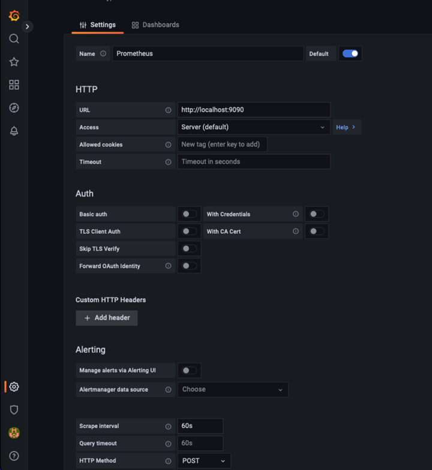
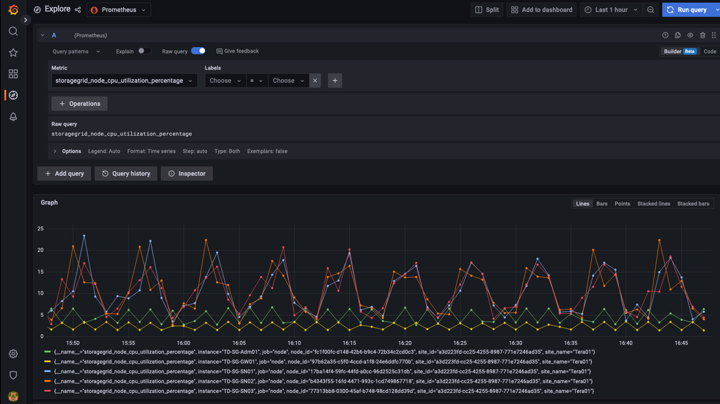
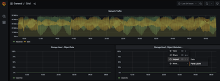

= Grâce à Prometheus et Grafana, vous pouvez renforcer la conservation des metrics
:allow-uri-read: 

_Aron Klein_

[role="lead"]
Ce rapport technique fournit des instructions détaillées sur la configuration de NetApp StorageGRID 11.6 avec des services Prometheus et Grafana externes.

== Introduction

StorageGRID stocke les metrics à l'aide de Prometheus et fournit des visualisations de ces metrics via des tableaux de bord intégrés. Vous pouvez accéder en toute sécurité aux metrics Prometheus depuis StorageGRID en configurant des certificats d'accès client et en activant l'accès prometheus pour le client spécifié. Aujourd'hui, la conservation de ces données de mesure est limitée par la capacité de stockage du nœud d'administration. Pour gagner plus de temps et pouvoir créer des visualisations personnalisées de ces metrics, nous déploierons un nouveau serveur Prometheus et Grafana, configurerons notre nouveau serveur afin de grattez les metrics à partir de l'instance IDS, et nous concevons un tableau de bord avec les mesures importantes. Vous pouvez obtenir plus d'informations sur les metrics Prometheus collectés dans la https://docs.netapp.com/us-en/storagegrid-116/monitor/commonly-used-prometheus-metrics.html["Documentation StorageGRID"^].

== Fédérer Prometheus

=== Détails de laboratoire

Pour les besoins de cet exemple, j'utiliserai toutes les machines virtuelles pour les nœuds StorageGRID 11.6 et un serveur Debian 11. L'interface de gestion StorageGRID est configurée avec un certificat d'autorité de certification public approuvé. Cet exemple ne passera pas par l'installation et la configuration du système StorageGRID ou de l'installation de Debian linux. Vous pouvez utiliser toutes les versions Linux que vous souhaitez prendre en charge par Prometheus et Grafana. Prometheus et Grafana peuvent être installés en tant que conteneurs docker, qu'ils soient issus de la source ou binaires précompilés. Dans cet exemple, je vais installer les binaires Prometheus et Grafana directement sur le même serveur Debian. Téléchargez et suivez les instructions d'installation de base sur https://prometheus.io[] et https://grafana.com/grafana/[] respectivement.

=== Configurez StorageGRID pour l'accès client Prometheus

Afin d'accéder aux identifiants de paramètres de la mémoire de la solution, vous devez générer ou télécharger un certificat client avec une clé privée et activer l'autorisation pour le client. L'interface de gestion StorageGRID doit posséder un certificat SSL. Ce certificat doit être approuvé par le serveur prometheus soit par une autorité de certification approuvée, soit manuellement approuvé s'il est auto-signé. Pour en savoir plus, consultez le https://docs.netapp.com/us-en/storagegrid-116/admin/configuring-administrator-client-certificates.html["Documentation StorageGRID"].

. Dans l'interface de gestion StorageGRID, sélectionnez « CONFIGURATION » en bas à gauche, puis dans la deuxième colonne sous « sécurité », cliquez sur certificats.
. Sur la page certificats, sélectionnez l'onglet « client » et cliquez sur le bouton « Ajouter ».
. Indiquez un nom pour le client auquel l'accès sera accordé et utilisez ce certificat. Cliquez sur la case sous "permissions", devant "Autoriser Prometheus" et cliquez sur le bouton Continuer.
+
image::../media/prometheus/cert_name.png[nom du certificat]

. Si vous disposez d'un certificat signé par l'autorité de certification, vous pouvez sélectionner le bouton radio « Télécharger le certificat », mais dans notre cas, nous allons permettre à StorageGRID de générer le certificat client en sélectionnant le bouton radio « générer le certificat ». Les champs obligatoires s'affichent pour être renseignés. Saisissez le FQDN du serveur client, l'adresse IP du serveur, l'objet et les jours valides. Cliquez ensuite sur le bouton « générer ».
+
image::../media/prometheus/cert_detail.png[détails du certificat]

[NOTE]
====
 Be mindful of the certificate days valid entry as you will need to renew this certificate in both StorageGRID and the Prometheus server before it expires to maintain uninterrupted collection.
====
. Téléchargez le fichier pem de certificat et le fichier pem de clé privée.
+
image::../media/prometheus/cert_download.png[téléchargement du certificat]

[NOTE]
====
 This is the only time you can download the private key, so make sure you do not skip this step.
====

=== Préparez le serveur Linux pour l'installation de Prometheus

Avant d'installer Prometheus, je souhaite préparer mon environnement avec un utilisateur Prometheus, la structure de répertoires et configurer la capacité pour l'emplacement de stockage des metrics.

. Créez l'utilisateur Prometheus.
+
[source, console]
----
sudo useradd -M -r -s /bin/false Prometheus
----
. Créez les répertoires pour les données Prometheus, les certificats client et les metrics.
+
[source, console]
----
sudo mkdir /etc/Prometheus /etc/Prometheus/cert /var/lib/Prometheus
----
. J'ai formaté le disque que j'utilise pour la rétention des metrics avec un système de fichiers ext4.
+
[listing]
----
mkfs -t ext4 /dev/sdb
----
. Je ai ensuite monté le système de fichiers dans le répertoire des metrics de Prometheus.
+
[listing]
----
sudo mount -t auto /dev/sdb /var/lib/prometheus/
----
. Obtenez l'UUID du disque que vous utilisez pour les données de metrics.
+
[listing]
----
sudo ls -al /dev/disk/by-uuid/
   lrwxrwxrwx 1 root root   9 Aug 18 17:02 9af2c5a3-bfc2-4ec1-85d9-ebab850bb4a1 -> ../../sdb
----
. Ajout d'une entrée dans /etc/fstab/ pour que le montage persiste entre les redémarrages à l'aide de l'UUID de /dev/sdb.
+
[listing]
----
/etc/fstab
UUID=9af2c5a3-bfc2-4ec1-85d9-ebab850bb4a1 /var/lib/prometheus	ext4	defaults	0	0
----

=== Installez et configurez Prometheus

Lorsque le serveur est prêt, je peux commencer l'installation de Prometheus et configurer le service.

. Extraire le pack d'installation Prometheus
+
[source, console]
----
tar xzf prometheus-2.38.0.linux-amd64.tar.gz
----
. Copiez les binaires dans /usr/local/bin et modifiez la propriété de l'utilisateur prometheus créé précédemment
+
[source, console]
----
sudo cp prometheus-2.38.0.linux-amd64/{prometheus,promtool} /usr/local/bin
sudo chown prometheus:prometheus /usr/local/bin/{prometheus,promtool}
----
. Copiez les consoles et les bibliothèques dans /etc/prometheus
+
[source, console]
----
sudo cp -r prometheus-2.38.0.linux-amd64/{consoles,console_libraries} /etc/prometheus/
----
. Copiez le certificat client et les fichiers pem de clé privée téléchargés précédemment de StorageGRID vers /etc/prometheus/certs
. Créez le fichier yaml de configuration prometheus
+
[source, console]
----
sudo nano /etc/prometheus/prometheus.yml
----
. Insérez la configuration suivante. Le nom du travail peut être tout ce que vous souhaitez. Remplacez les « cibles : [''] » par le FQDN du nœud admin, et si vous avez modifié les noms des certificats et des fichiers de clé privée, mettez à jour la section tls_config pour qu'elle corresponde. enregistrez ensuite le fichier. Si votre interface de gestion de grille utilise un certificat auto-signé, téléchargez le certificat et placez-le avec un nom unique, et dans la section tls_config, ajoutez ca_file: /Etc/prometheus/cert/UIcert.pem
+
.. Dans cet exemple, je collecterai tous les metrics commençant par alertManager, cassandra, nœud et StorageGRID. Vous trouverez plus d'informations sur les metrics Prometheus dans la https://docs.netapp.com/us-en/storagegrid-116/monitor/commonly-used-prometheus-metrics.html["Documentation StorageGRID"^].
+
[source, yaml]
----
# my global config
global:
  scrape_interval: 60s # Set the scrape interval to every 15 seconds. Default is every 1 minute.

scrape_configs:
  - job_name: 'StorageGRID'
    honor_labels: true
    scheme: https
    metrics_path: /federate
    scrape_interval: 60s
    scrape_timeout: 30s
    tls_config:
      cert_file: /etc/prometheus/cert/certificate.pem
      key_file: /etc/prometheus/cert/private_key.pem
    params:
      match[]:
        - '{__name__=~"alertmanager_.*|cassandra_.*|node_.*|storagegrid_.*"}'
    static_configs:
    - targets: ['sgdemo-rtp.netapp.com:9091']
----

[NOTE]
====
Si votre interface de gestion du grid utilise un certificat auto-signé, téléchargez le certificat et placez-le avec le certificat client portant un nom unique. Dans la section tls_config, ajoutez le certificat au-dessus du certificat client et des lignes de clé privée

....
        ca_file: /etc/prometheus/cert/UIcert.pem
....
====
. Modifiez la propriété de tous les fichiers et répertoires dans /etc/prometheus et /var/lib/prometheus pour l'utilisateur prometheus
+
[source, console]
----
sudo chown -R prometheus:prometheus /etc/prometheus/
sudo chown -R prometheus:prometheus /var/lib/prometheus/
----
. Créez un fichier de service prometheus dans /etc/systemd/system
+
[source, console]
----
sudo nano /etc/systemd/system/prometheus.service
----
. Insérez les lignes suivantes, notez le #--Storage.tsdb.rerétention=1A# qui définit la conservation des données de mesure sur 1 an. Vous pouvez également utiliser #--Storage.tsdb.Retention.size=300 Gio# pour la conservation sur les limites de stockage. C'est le seul emplacement pour définir la conservation des métriques.
+
[source, console]
----
[Unit]
Description=Prometheus Time Series Collection and Processing Server
Wants=network-online.target
After=network-online.target

[Service]
User=prometheus
Group=prometheus
Type=simple
ExecStart=/usr/local/bin/prometheus \
        --config.file /etc/prometheus/prometheus.yml \
        --storage.tsdb.path /var/lib/prometheus/ \
        --storage.tsdb.retention.time=1y \
        --web.console.templates=/etc/prometheus/consoles \
        --web.console.libraries=/etc/prometheus/console_libraries

[Install]
WantedBy=multi-user.target
----
. Rechargez le service systemd pour enregistrer le nouveau service prometheus. démarrez et activez ensuite le service prometheus.
+
[source, console]
----
sudo systemctl daemon-reload
sudo systemctl start prometheus
sudo systemctl enable prometheus
----
. Vérifiez que l'entretien fonctionne correctement
+
[source, console]
----
sudo systemctl status prometheus
----
+
[listing]
----
● prometheus.service - Prometheus Time Series Collection and Processing Server
     Loaded: loaded (/etc/systemd/system/prometheus.service; enabled; vendor preset: enabled)
     Active: active (running) since Mon 2022-08-22 15:14:24 EDT; 2s ago
   Main PID: 6498 (prometheus)
      Tasks: 13 (limit: 28818)
     Memory: 107.7M
        CPU: 1.143s
     CGroup: /system.slice/prometheus.service
             └─6498 /usr/local/bin/prometheus --config.file /etc/prometheus/prometheus.yml --storage.tsdb.path /var/lib/prometheus/ --web.console.templates=/etc/prometheus/consoles --web.con>

Aug 22 15:14:24 aj-deb-prom01 prometheus[6498]: ts=2022-08-22T19:14:24.510Z caller=head.go:544 level=info component=tsdb msg="Replaying WAL, this may take a while"
Aug 22 15:14:24 aj-deb-prom01 prometheus[6498]: ts=2022-08-22T19:14:24.816Z caller=head.go:615 level=info component=tsdb msg="WAL segment loaded" segment=0 maxSegment=1
Aug 22 15:14:24 aj-deb-prom01 prometheus[6498]: ts=2022-08-22T19:14:24.816Z caller=head.go:615 level=info component=tsdb msg="WAL segment loaded" segment=1 maxSegment=1
Aug 22 15:14:24 aj-deb-prom01 prometheus[6498]: ts=2022-08-22T19:14:24.816Z caller=head.go:621 level=info component=tsdb msg="WAL replay completed" checkpoint_replay_duration=55.57µs wal_rep>
Aug 22 15:14:24 aj-deb-prom01 prometheus[6498]: ts=2022-08-22T19:14:24.831Z caller=main.go:997 level=info fs_type=EXT4_SUPER_MAGIC
Aug 22 15:14:24 aj-deb-prom01 prometheus[6498]: ts=2022-08-22T19:14:24.831Z caller=main.go:1000 level=info msg="TSDB started"
Aug 22 15:14:24 aj-deb-prom01 prometheus[6498]: ts=2022-08-22T19:14:24.831Z caller=main.go:1181 level=info msg="Loading configuration file" filename=/etc/prometheus/prometheus.yml
Aug 22 15:14:24 aj-deb-prom01 prometheus[6498]: ts=2022-08-22T19:14:24.832Z caller=main.go:1218 level=info msg="Completed loading of configuration file" filename=/etc/prometheus/prometheus.y>
Aug 22 15:14:24 aj-deb-prom01 prometheus[6498]: ts=2022-08-22T19:14:24.832Z caller=main.go:961 level=info msg="Server is ready to receive web requests."
Aug 22 15:14:24 aj-deb-prom01 prometheus[6498]: ts=2022-08-22T19:14:24.832Z caller=manager.go:941 level=info component="rule manager" msg="Starting rule manager..."
----
. Vous devez maintenant pouvoir naviguer vers l'interface du serveur prometheus http://Prometheus-server:9090[] Et voir l'interface utilisateur
+
image::../media/prometheus/prometheus_ui.png[Page interface utilisateur de prometheus]

. Sous cibles « Status », vous pouvez consulter le statut du noeud final StorageGRID configuré dans prometheus.yml
+
image::../media/prometheus/prometheus_targets.png[menu d'état prometheus]

+
image::../media/prometheus/prometheus_target_status.png[page cibles de prometheus]

. Sur la page graphique, vous pouvez exécuter une requête de test et vérifier que les données sont scrapées avec succès. Par exemple, entrez « storagegrid_node_cpu_usage_percent » dans la barre de requêtes et cliquez sur le bouton Exécuter.
+
image::../media/prometheus/prometheus_execute.png[exécution des requêtes prometheus]

== Installer et configurer Grafana

Vous pouvez désormais installer Grafana et configurer un tableau de bord

=== Grafana Installation

. Installez la dernière édition Enterprise de Grafana
+
[source, console]
----
sudo apt-get install -y apt-transport-https
sudo apt-get install -y software-properties-common wget
sudo wget -q -O /usr/share/keyrings/grafana.key https://packages.grafana.com/gpg.key
----
. Ajouter ce référentiel pour les versions stables :
+
[source, console]
----
echo "deb [signed-by=/usr/share/keyrings/grafana.key] https://packages.grafana.com/enterprise/deb stable main" | sudo tee -a /etc/apt/sources.list.d/grafana.list
----
. Après avoir ajouté le référentiel.
+
[source, console]
----
sudo apt-get update
sudo apt-get install grafana-enterprise
----
. Rechargez le service systemd pour enregistrer le nouveau service grafana. Démarrez et activez ensuite le service Grafana.
+
[source, console]
----
sudo systemctl daemon-reload
sudo systemctl start grafana-server
sudo systemctl enable grafana-server.service
----
. Grafana est désormais installé et exécuté. Lorsque vous ouvrez un navigateur vers HTTP://Prometheus-Server:3000, vous êtes accueilli par la page de connexion de Grafana.
. Les informations d'identification par défaut sont admin/admin et vous devez définir un nouveau mot de passe à mesure qu'il vous invite à.

=== Créez un tableau de bord Grafana pour StorageGRID

Lorsque vous installez et exécutez Grafana et Prometheus, vous pouvez désormais vous connecter en créant une source de données et en créant un tableau de bord

. Dans le volet de gauche, développez « Configuration » et sélectionnez « sources de données », puis cliquez sur le bouton « Ajouter une source de données »
. Prometheus est une des principales sources de données. Si ce n'est pas le cas, utilisez la barre de recherche pour trouver Prometheus
. Configurez la source Prometheus en entrant l'URL de l'instance prometheus et l'intervalle de récupération en fonction de l'intervalle Prometheus. J'ai également désactivé la section d'alertes car je n'ai pas configuré le gestionnaire d'alertes sur prometheus.
+

. Une fois les paramètres souhaités saisis, faites défiler l'écran vers le bas et cliquez sur « Enregistrer et tester ».
. Une fois le test de configuration réussi, cliquez sur le bouton Explorer.
+
.. Dans la fenêtre d'exploration, vous pouvez utiliser la même mesure que Prometheus testée avec « storagegrid_node_cpu_use_percent », puis cliquez sur le bouton Run Query
+

. Comme la source de données est configurée, nous pouvons créer un tableau de bord.
+
.. Dans le volet de gauche, développez « tableaux de bord » et sélectionnez « + nouveau tableau de bord ».
.. Sélectionnez « Ajouter un nouveau panneau »
.. Configurez le nouveau panneau en sélectionnant une mesure, puis j'utiliserai à nouveau « storagegrid_node_cpu_use_percentage », saisissez un titre pour le panneau, développez « Options » en bas et pour changer de légende en personnalisé et entrez «{{instance} » pour définir les noms de nœud, et à droite sous « Options standard » définissez « unité » sur « 100 % ». Cliquez ensuite sur « appliquer » pour enregistrer le panneau dans le tableau de bord.
+
image::../media/prometheus/grafana_panel_conf.png[configurer le panneau grafana]

. Nous pouvons continuer à concevoir notre tableau de bord de ce type pour chaque metric souhaité, mais heureusement que StorageGRID dispose déjà de tableaux de bord avec des panneaux que nous pouvons copier dans nos tableaux de bord personnalisés.
+
.. Dans le volet gauche de l'interface de gestion StorageGRID, sélectionnez « support », et en bas de la colonne « Outils », cliquez sur métriques.
.. Dans les mesures, je vais sélectionner le lien « grille » en haut de la colonne centrale.
+
image::../media/prometheus/storagegrid_metrics.png[Metrics StorageGRID]

.. Dans le tableau de bord Grid, sélectionnez le panneau « stockage utilisé - métadonnées de l'objet ». Cliquez sur la petite flèche vers le bas et sur la fin du titre du panneau pour faire descendre un menu. Dans ce menu, sélectionnez « inspection » et « panneau JSON ».
+

.. Copiez le code JSON et fermez la fenêtre.
+
image::../media/prometheus/storagegrid_panel_inspect.png[StorageGRID JSON]

.. Dans notre nouveau tableau de bord, cliquez sur l'icône pour ajouter un nouveau panneau.
+
image::../media/prometheus/grafana_add_panel.png[ajout de grafana]

.. Appliquez le nouveau panneau sans apporter de modifications
.. Inspecter le fichier JSON, et tout comme dans le panneau StorageGRID. Supprimez tout code JSON et remplacez-le par le code copié du panneau StorageGRID.
+
image::../media/prometheus/grafana_panel_inspect.png[panneau d'inspection grafana]

.. Modifiez le nouveau panneau et, à droite, un message migration s'affiche avec un bouton « migrer ». Cliquez sur le bouton, puis sur le bouton « appliquer ».
+
image::../media/prometheus/grafana_panel_edit_menu.png[menu du panneau d'édition grafana]

+

. Une fois tous les panneaux en place et configurés comme vous le souhaitez. Enregistrez le tableau de bord en cliquant sur l'icône du disque dans le coin supérieur droit et donnez un nom à votre tableau de bord.

=== Conclusion

Nous disposons désormais d'un serveur Prometheus avec une capacité de stockage et de conservation des données personnalisables. Grâce à cela, nous pouvons continuer à élaborer nos propres tableaux de bord avec les mesures les plus pertinentes pour nos opérations. Vous pouvez obtenir plus d'informations sur les metrics Prometheus collectés dans la https://docs.netapp.com/us-en/storagegrid-116/monitor/commonly-used-prometheus-metrics.html["Documentation StorageGRID"^].
