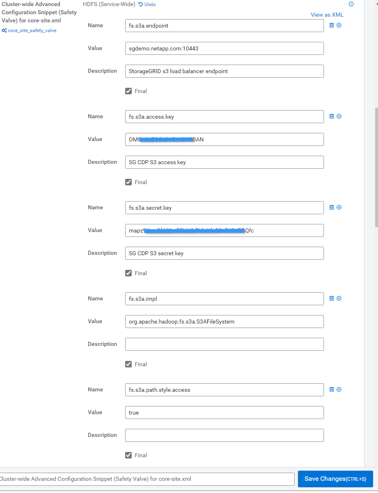

= Utilisez le connecteur Cloudera Hadoop S3A avec StorageGRID
:allow-uri-read: 

[role="lead"]
Hadoop est devenu la favori des data Scientists depuis quelque temps. Hadoop permet le traitement distribué d'importants jeux de données sur des clusters d'ordinateurs à l'aide d'infrastructures de programmation simples. Hadoop a été conçu pour évoluer verticalement de serveurs uniques à des milliers de machines, chaque machine étant en possession de ressources de calcul et de stockage locales.

== Pourquoi utiliser S3A pour les flux de travail Hadoop ?

Comme le volume de données a augmenté au fil du temps, l'approche qui consiste à ajouter de nouveaux ordinateurs avec leurs propres ressources de calcul et de stockage est devenue inefficace. Vous pouvez relever les défis liés à l'évolutivité linéaire des caisses afin d'utiliser efficacement les ressources et de gérer l'infrastructure.

Pour relever ces challenges, le client Hadoop S3A propose des E/S haute performance par rapport au stockage objet S3. L'implémentation d'un workflow Hadoop avec S3A vous permet d'exploiter le stockage objet en tant que référentiel de données et de séparer les ressources de calcul et de stockage. Vous pouvez ainsi faire évoluer indépendamment les ressources de calcul et de stockage. Qui dissocie le calcul et le stockage pour vous permettre de consacrer la quantité de ressources adaptée à vos tâches de calcul, et d'assurer la capacité en fonction de la taille de votre jeu de données. Par conséquent, vous pouvez réduire votre TCO global pour les workflows Hadoop.

== Configurer le connecteur S3A pour utiliser StorageGRID

=== Prérequis

* Une URL de terminal StorageGRID S3, une clé d'accès s3 pour un locataire et une clé secrète pour le test de connexion à Hadoop S3A.
* Un cluster Cloudera ainsi que l'autorisation root ou sudo pour chaque hôte du cluster afin d'installer le package Java.

En avril 2022, Java 11.0.14 avec Cloudera 7.1.7 a été testé contre StorageGRID 11.5 et 11.6. Cependant, le numéro de version de Java peut être différent au moment d'une nouvelle installation.

=== Installez le package Java

. Vérifier le https://docs.cloudera.com/cdp-private-cloud-upgrade/latest/release-guide/topics/cdpdc-java-requirements.html["Matrice de support Cloudera"^] Pour la version JDK prise en charge.
. Téléchargez le https://www.oracle.com/java/technologies/downloads/["Package Java 11.x"^] Correspondant au système d'exploitation du cluster Cloudera. Copiez ce package sur chaque hôte du cluster. Dans cet exemple, le progiciel rpm est utilisé pour CentOS.
. Connectez-vous à chaque hôte en tant que root ou en utilisant un compte avec l'autorisation sudo. Effectuez les étapes suivantes sur chaque hôte :
+
.. Installez le package :
+
[listing]
----
$ sudo rpm -Uvh jdk-11.0.14_linux-x64_bin.rpm
----
.. Vérifiez l'emplacement d'installation de Java. Si plusieurs versions sont installées, définissez la nouvelle version installée par défaut :
+
[listing, subs="specialcharacters,quotes"]
----
alternatives --config java

There are 2 programs which provide 'java'.

  Selection    Command
-----------------------------------------------
 +1           /usr/java/jre1.8.0_291-amd64/bin/java
  2           /usr/java/jdk-11.0.14/bin/java

Enter to keep the current selection[+], or type selection number: 2
----
.. Ajoutez cette ligne à la fin de `/etc/profile`. Le chemin doit correspondre au chemin de la sélection ci-dessus :
+
[listing]
----
export JAVA_HOME=/usr/java/jdk-11.0.14
----
.. Exécutez la commande suivante pour que le profil prenne effet :
+
[listing]
----
source /etc/profile
----

=== Configuration HDFS S3A de Cloudera

*Étapes*

. Dans l'interface graphique Cloudera Manager, sélectionnez clusters > HDFS et sélectionnez Configuration.
. Sous CATÉGORIE, sélectionnez Avancé, puis faites défiler vers le bas pour rechercher `Cluster-wide Advanced Configuration Snippet (Safety Valve) for core-site.xml`.
. Cliquez sur le signe (+) et ajoutez les paires de valeurs suivantes.
+
[cols="1a,4a"]
|===
| Nom | Valeur 

 a| 
fs.s3a.access.key
 a| 
_<clé d'accès s3 de StorageGRID>_

 a| 
fs.s3a.secret.key
 a| 
_<clé secrète S3 du locataire StorageGRID>_

 a| 
fs.s3a.connection.ssl.enabled
 a| 
[vrai ou faux] (la valeur par défaut est https si cette entrée est manquante)

 a| 
fs.s3a.endpoint
 a| 
_<noeud final StorageGRID S3:port>_

 a| 
fs.s3a.impl
 a| 
ORG.apache.hadoop.fs.s3a.S3AFileSystem

 a| 
fs.s3a.path.style.access
 a| 
[vrai ou faux] (le style d'hôte virtuel par défaut est défini si cette entrée est manquante)

|===
+
*Exemple de capture d'écran*

+

. Cliquez sur le bouton Enregistrer les modifications. Sélectionnez l'icône Configuration obsolète dans la barre de menus HDFS, sélectionnez redémarrer les services obsolètes sur la page suivante, puis sélectionnez redémarrer maintenant.
+
image::../media/hadoop-s3a/hadoop-restart-stale-service-icon.png[Redémarrez l'icône de service obsolète pour Hadoop]

== Tester la connexion S3A à StorageGRID

=== Effectuer un test de connexion de base

Connectez-vous à l'un des hôtes du cluster Cloudera, puis entrez `hadoop fs -ls s3a://_<bucket-name>_/`.

L'exemple suivant utilise le chemin syle avec un compartiment hdfs-test pré-existant et un objet test.

[listing]
----
[root@ce-n1 ~]# hadoop fs -ls s3a://hdfs-test/
22/02/15 18:24:37 WARN impl.MetricsConfig: Cannot locate configuration: tried hadoop-metrics2-s3a-file-system.properties,hadoop-metrics2.properties
22/02/15 18:24:37 INFO impl.MetricsSystemImpl: Scheduled Metric snapshot period at 10 second(s).
22/02/15 18:24:37 INFO impl.MetricsSystemImpl: s3a-file-system metrics system started
22/02/15 18:24:37 INFO Configuration.deprecation: No unit for fs.s3a.connection.request.timeout(0) assuming SECONDS
Found 1 items
-rw-rw-rw-   1 root root       1679 2022-02-14 16:03 s3a://hdfs-test/test
22/02/15 18:24:38 INFO impl.MetricsSystemImpl: Stopping s3a-file-system metrics system...
22/02/15 18:24:38 INFO impl.MetricsSystemImpl: s3a-file-system metrics system stopped.
22/02/15 18:24:38 INFO impl.MetricsSystemImpl: s3a-file-system metrics system shutdown complete.
----

=== Dépannage

==== Scénario 1

Utilisez une connexion HTTPS à StorageGRID et obtenez un `handshake_failure` erreur après un délai de 15 minutes.

*Raison :* ancienne version JRE/JDK utilisant la suite de chiffrement TLS obsolète ou non prise en charge pour la connexion à StorageGRID.

*Exemple de message d'erreur*

[listing]
----
[root@ce-n1 ~]# hadoop fs -ls s3a://hdfs-test/
22/02/15 18:52:34 WARN impl.MetricsConfig: Cannot locate configuration: tried hadoop-metrics2-s3a-file-system.properties,hadoop-metrics2.properties
22/02/15 18:52:34 INFO impl.MetricsSystemImpl: Scheduled Metric snapshot period at 10 second(s).
22/02/15 18:52:34 INFO impl.MetricsSystemImpl: s3a-file-system metrics system started
22/02/15 18:52:35 INFO Configuration.deprecation: No unit for fs.s3a.connection.request.timeout(0) assuming SECONDS
22/02/15 19:04:51 INFO impl.MetricsSystemImpl: Stopping s3a-file-system metrics system...
22/02/15 19:04:51 INFO impl.MetricsSystemImpl: s3a-file-system metrics system stopped.
22/02/15 19:04:51 INFO impl.MetricsSystemImpl: s3a-file-system metrics system shutdown complete.
22/02/15 19:04:51 WARN fs.FileSystem: Failed to initialize fileystem s3a://hdfs-test/: org.apache.hadoop.fs.s3a.AWSClientIOException: doesBucketExistV2 on hdfs: com.amazonaws.SdkClientException: Unable to execute HTTP request: Received fatal alert: handshake_failure: Unable to execute HTTP request: Received fatal alert: handshake_failure
ls: doesBucketExistV2 on hdfs: com.amazonaws.SdkClientException: Unable to execute HTTP request: Received fatal alert: handshake_failure: Unable to execute HTTP request: Received fatal alert: handshake_failure
----
*Résolution :* Assurez-vous que JDK 11.x ou version ultérieure est installé et défini par défaut la bibliothèque Java. Reportez-vous à la <<Installez le package Java>> pour plus d'informations.

==== Scénario 2 :

Impossible de se connecter à StorageGRID avec message d'erreur `Unable to find valid certification path to requested target`.

*Raison:* le certificat du serveur de noeuds finaux StorageGRID S3 n'est pas approuvé par le programme Java.

Exemple de message d'erreur :

[listing]
----
[root@hdp6 ~]# hadoop fs -ls s3a://hdfs-test/
22/03/11 20:58:12 WARN impl.MetricsConfig: Cannot locate configuration: tried hadoop-metrics2-s3a-file-system.properties,hadoop-metrics2.properties
22/03/11 20:58:13 INFO impl.MetricsSystemImpl: Scheduled Metric snapshot period at 10 second(s).
22/03/11 20:58:13 INFO impl.MetricsSystemImpl: s3a-file-system metrics system started
22/03/11 20:58:13 INFO Configuration.deprecation: No unit for fs.s3a.connection.request.timeout(0) assuming SECONDS
22/03/11 21:12:25 INFO impl.MetricsSystemImpl: Stopping s3a-file-system metrics system...
22/03/11 21:12:25 INFO impl.MetricsSystemImpl: s3a-file-system metrics system stopped.
22/03/11 21:12:25 INFO impl.MetricsSystemImpl: s3a-file-system metrics system shutdown complete.
22/03/11 21:12:25 WARN fs.FileSystem: Failed to initialize fileystem s3a://hdfs-test/: org.apache.hadoop.fs.s3a.AWSClientIOException: doesBucketExistV2 on hdfs: com.amazonaws.SdkClientException: Unable to execute HTTP request: PKIX path building failed: sun.security.provider.certpath.SunCertPathBuilderException: unable to find valid certification path to requested target: Unable to execute HTTP request: PKIX path building failed: sun.security.provider.certpath.SunCertPathBuilderException: unable to find valid certification path to requested target
----
*Resolution:* NetApp recommande d'utiliser un certificat de serveur délivré par une autorité de signature de certificat public connu pour s'assurer que l'authentification est sécurisée. Vous pouvez également ajouter un certificat d'autorité de certification ou de serveur personnalisé au magasin de confiance Java.

Procédez comme suit pour ajouter une autorité de certification ou un certificat de serveur personnalisé StorageGRID au magasin d'approbation Java.

. Sauvegardez le fichier Java cacerts existant par défaut.
+
[listing]
----
cp -ap $JAVA_HOME/lib/security/cacerts $JAVA_HOME/lib/security/cacerts.orig
----
. Importez le certificat de noeud final StorageGRID S3 dans le magasin de confiance Java.
+
[listing, subs="specialcharacters,quotes"]
----
keytool -import -trustcacerts -keystore $JAVA_HOME/lib/security/cacerts -storepass changeit -noprompt -alias sg-lb -file _<StorageGRID CA or server cert in pem format>_
----

==== Conseils de dépannage

. Augmentez le niveau de journalisation hadoop pour DÉBOGUER.
+
`export HADOOP_ROOT_LOGGER=hadoop.root.logger=DEBUG,console`

. Exécutez la commande et dirigez les messages du journal vers error.log.
+
`hadoop fs -ls s3a://_<bucket-name>_/ &>error.log`

